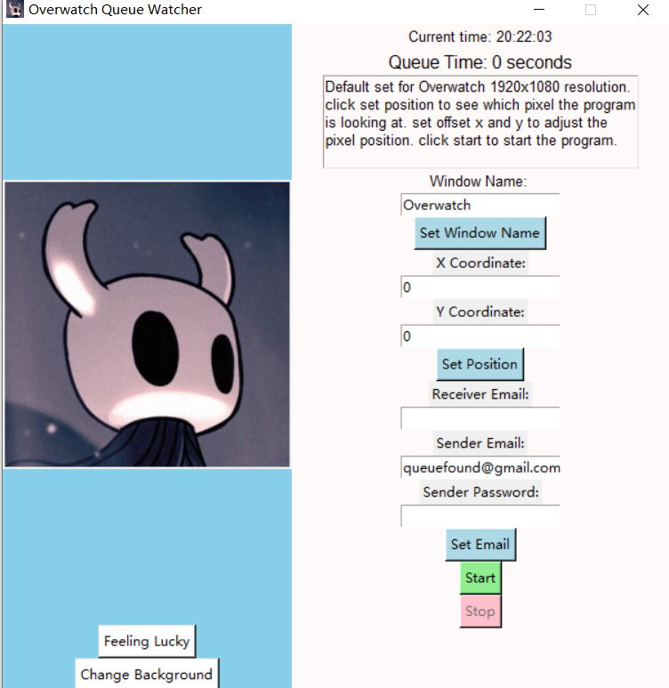
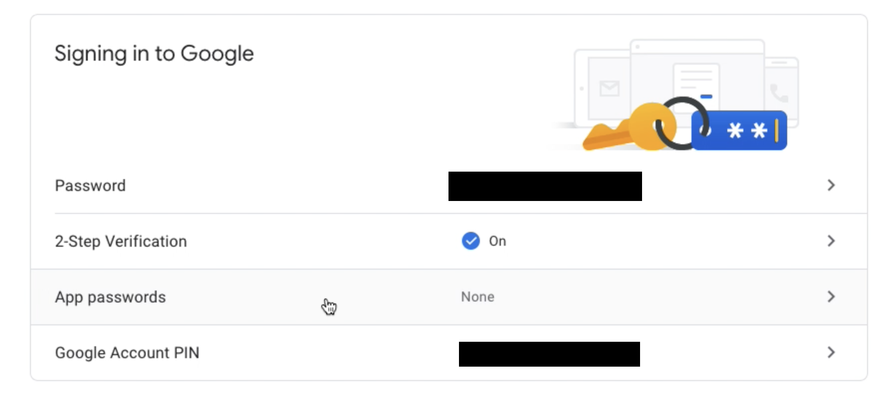
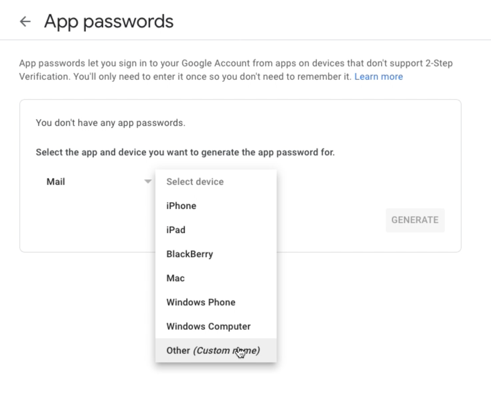
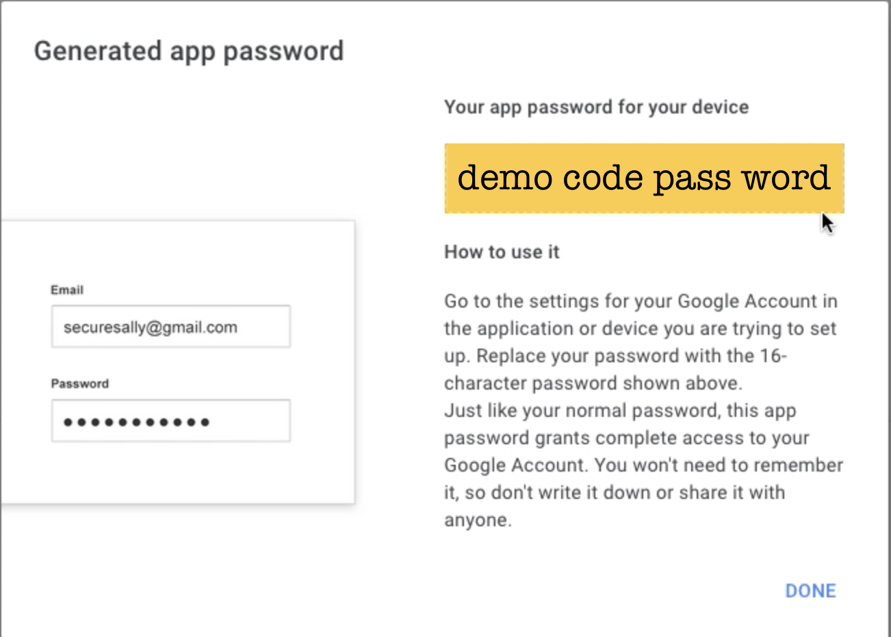

# Overwatch 2 Queue Notifier

 send you discord notification or email notification when the queue is done.

discord bot is not deployed on cloud so you need to host it yourself. checkout the [dcbot branch](https://github.com/qihang-dai/Overwatch2_QueueNotifier/tree/dcbot)

dev logs in notion [here](https://www.notion.so/Overwatch-Queue-Project-73d4bdb41b204aee8fdac16113148adb)

## Download .exe file

Small 16 MB file, though i add some big gif images to make it look better. compressed in zip file.

[Download](https://github.com/qihang-dai/Overwatch2_QueueNotifier)

## Future features

1. add webhook for easily discord push notifications

## How it works

**Default Designed for windows 10, Overwatch2 1920x1080 resolution, but could be used for other game** as long as you know the pixel position of the queue status.

1. the program will call the game window you want to be the foreground window, and then take a screenshot of the monitor (must be main monitor if you have multiple monitors). 

2. then it will check the color of a pixel position you set in the screenshot every 5 seconds. if the color is not the same as the color of the pixel in the screenshot when the queue is not done then it will send you a notification.

By default it will send email from my registrated email address **queuefound@gmail.com**.  However gmail set a limit for 500 outgoing emails limit perday. Thus if you want to use your own email address, for gmail check [Enabling SMTP Settings for a Gmail Inbox](https://help.accredible.com/smtp-setup-in-gmail-inbox) to generate an app password since gmail disabled the less secure app access (you can not directly use your gmail password to send email since 2022).

## why images are in root folder?

when pack the app into a single exe file using pyinstaller, for the exe the images can only be accessed if they are in the root folder.

Its a bit tricky to make it work with images. solved by: `pyinstaller --noconfirm --onefile --noconsole --add-data "hollow*;." --add-data "*.gif;." main.py` [stackOverflow](https://stackoverflow.com/a/72060275)

for light weight withoug big fif file, use `pyinstaller --noconfirm --onefile --noconsole --add-data "hollow*;." -i "hollow.ico" main.py` (set icon)

when use the pyinstaller, be sure to create a virtual environment and install all requried packages in the virtual environment. `python -m venv venv` and `venv\Scripts\activate` is enough. `deactivate` to go back to the base env.

otherwise the exe file will be very big. `pipreqs` that automatically generate requriements.txt somehow generate unnecessary packages and miss required packages in the requriments.txt file.