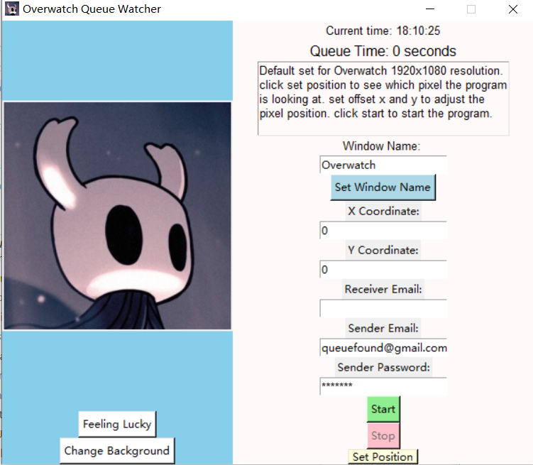

# Overwatch 2 Queue Notifier

 send you discord notification or email notification when the queue is done.

## How it works

Default Designed for windows 10, Overwatch2 1920x1080 resolution, but could be used for other games/programs as long as you know the pixel position of the queue status.

1. the program will call the game window you want to be the foreground window, and then take a screenshot of the monitor (must be main monitor if you have multiple monitors). 

2. then it will check the color of a pixel position you set in the screenshot every 5 seconds. if the color is not the same as the color of the pixel in the screenshot when the queue is not done then it will send you a notification.

By default it will send email from my registrated email address **queuefound@gmail.com**

dcbot is not deployed on cloud so you need to host it yourself. checkout the [dcbot branch](https://github.com/qihang-dai/Overwatch2_QueueNotifier/tree/dcbot)

## why images are in root folder?

when pack the app into a single exe file using pyinstaller, for the exe the images can only be accessed if they are in the root folder.

Its a bit tricky to make it work with images. solved by: `pyinstaller --noconfirm --onefile --noconsole --add-data "hollow*;." --add-data "*.gif;." main.py`

when use the pyinstaller, be sure to create a virtual environment and install all the packages in the virtual environment. otherwise the exe file will be very big.